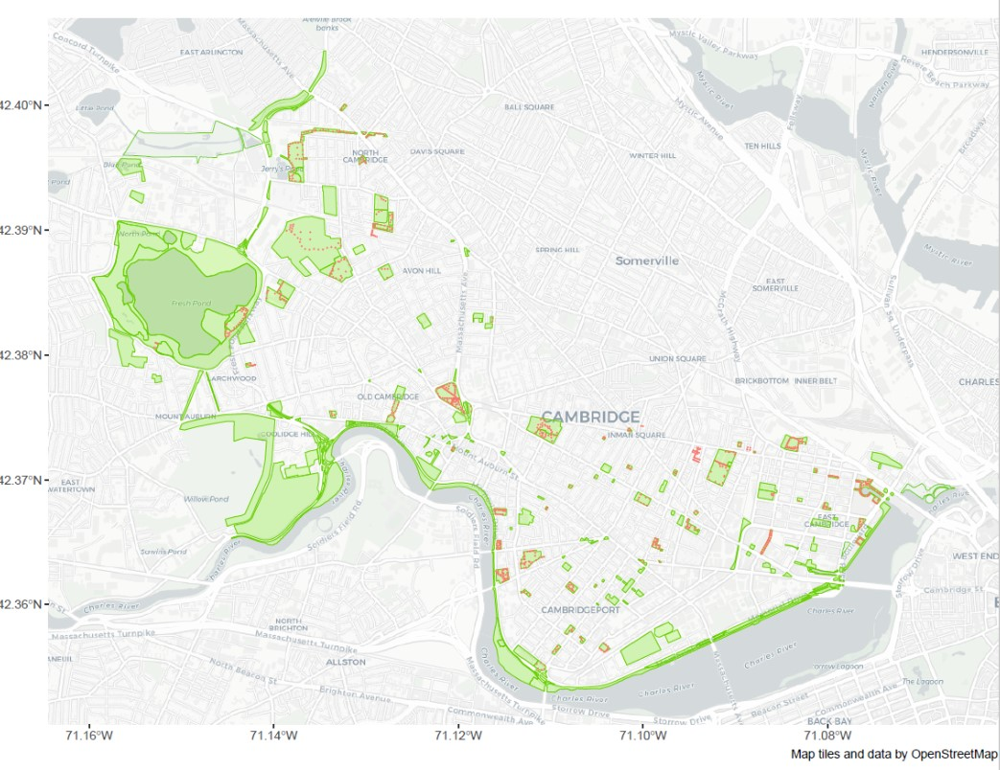
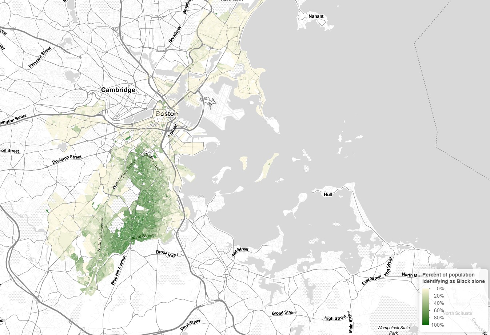
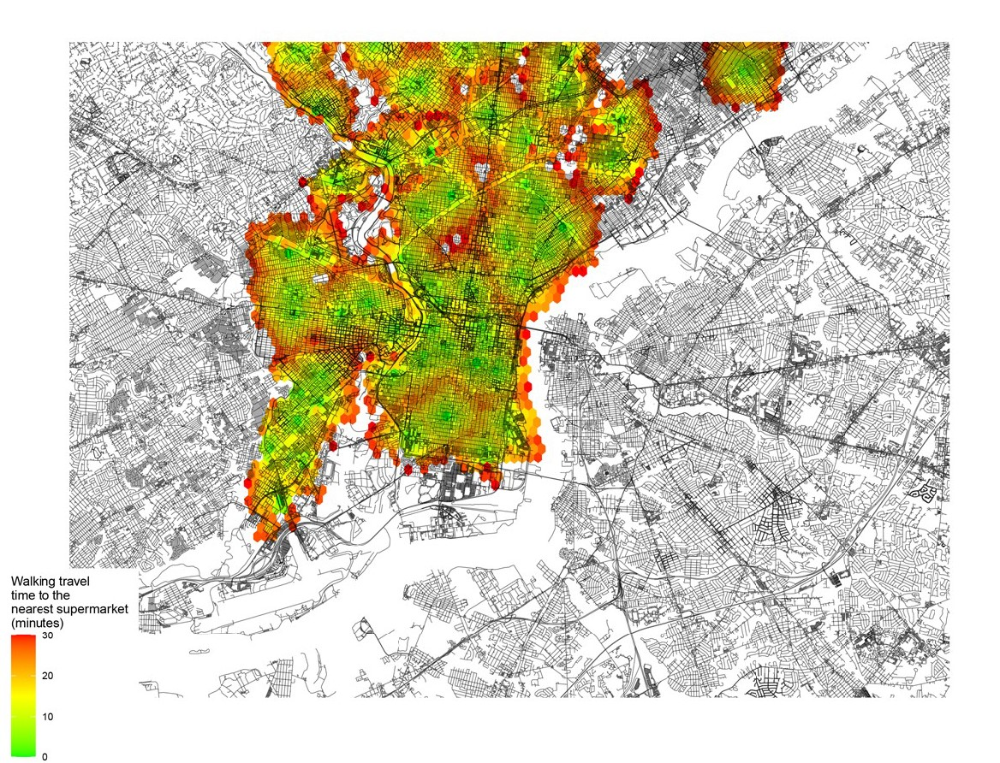
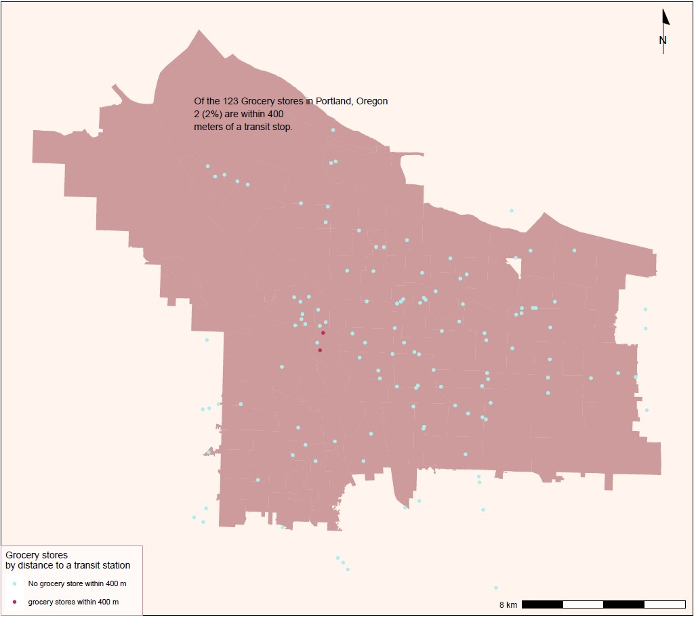
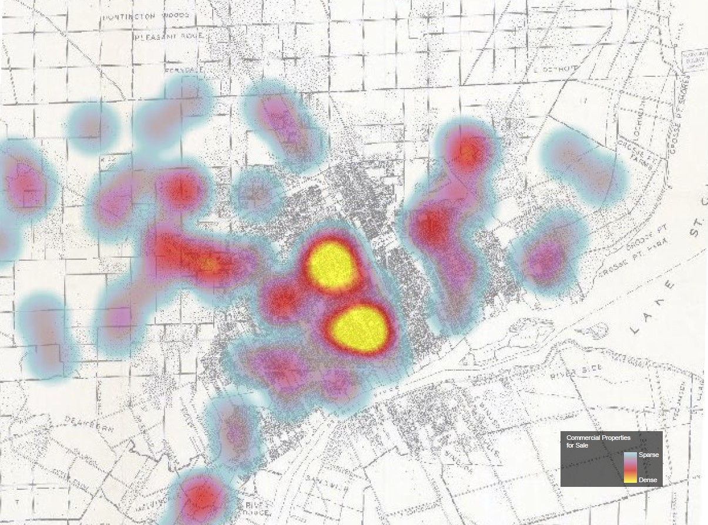

```{r setup, include=FALSE}
knitr::opts_chunk$set(echo = TRUE)

library(rmdformats)
```

# Introduction

This is a portfolio of maps created in the course of VIS2128 class, during which we have learnt how to prepare, display and analyze maps using RStudio. 

This page was created in RMarkdown. 


# Cambridge - green spaces and lighting
This map was created to investigate whether green open spaces in Cambridge are well lit. 
As can be seen, parks are lit only partially. 

[](https://wladka.github.io/portfolio/fullsize/1_as1.pdf){target="_blank"}

# Boston - population under the age of 18 
This interactive map depicts the population which is under the age of 18 in Boston.

[](https://wladka.github.io/portfolio/fullsize/inter_kids.html){target="_blank"}


# Philadelphia - food accessibility by mode of commute
Here is a map that demonstrates food accessibility in Philadelphia.
According to the idea of 15 minute city, all basic services and functions should be accessible within 15 minutes walk (green to yellow on the map). Walking to the grocery store for up to 30 minutes is depicted in red colour, and other areas with no colour at all can be described as food deserts. That means, it would take more that 30 minutes to reach the grocery store on foot.

[](https://wladka.github.io/portfolio/fullsize/as 4.pdf){target="_blank"}

# Portland - food accessibility from public transit stop
This map shows the grocery stores in Portland, Oregon with regard to their accessibility from public transit stops. In blue, there are grocery stores which are further that 400 m from the transit stops, and in red those that are witin 400 m walk. 

As it can be seen, only 2 grocery stores out of 123 stores considered are within 400 m reach.

[](https://wladka.github.io/portfolio/fullsize/portland.pdf){target="_blank"}

# Detroit - georeferencing a map 

The background of this map is a map of Detroit from 1936. The map depicts the population density, which is marked with dots. First, the original was scanned and georeferenced in GIS, then a new layer of data was added. The new map depicts where commercial properties for sale are located - the data are from 2000. It is visible that the biggest concentration is in the very central part of Detroit, the most densly populated. 

[](https://wladka.github.io/portfolio/fullsize/detroit.jpg){target="_blank"}

